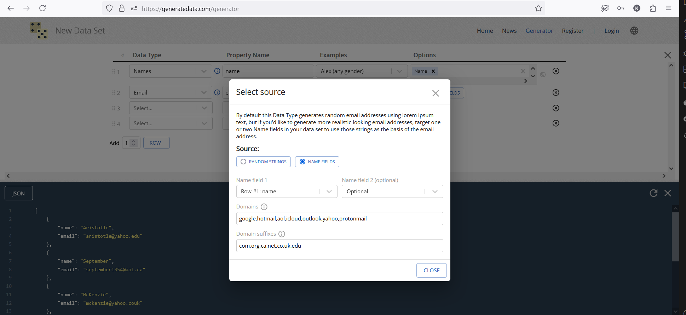
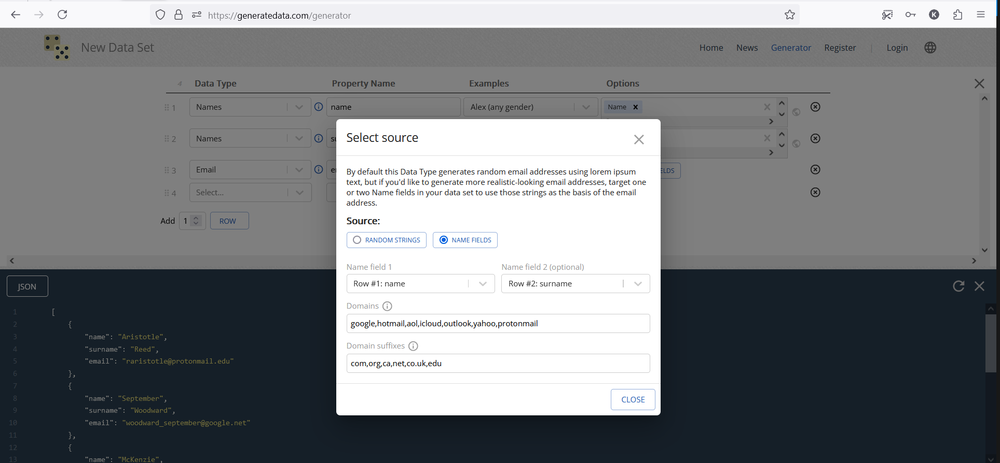
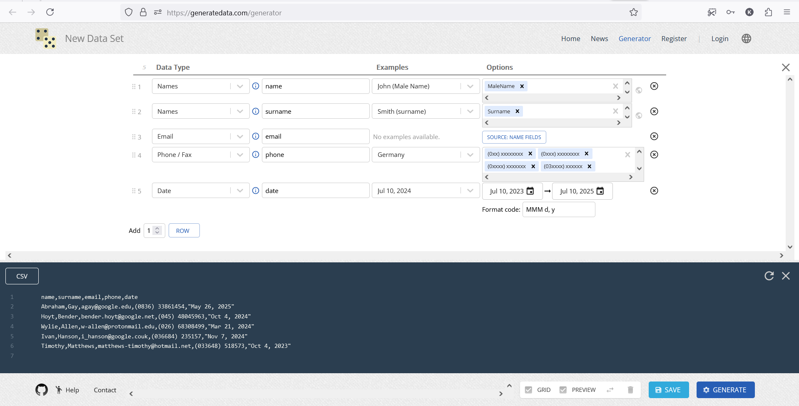

# [generatedata.com/generator](https://generatedata.com/generator)

website for generating test data

## pros:

 1. can generate field using other fields. 

Example for email generation:
   
   

 2. wide choice of data generators and their customization 

   <a href="https://github.com/benkeen/generatedata/tree/master/client/src/plugins/dataTypes">data generators</a>
   
   generators customization
   

## cons:

1. can generate only one table per one time
2. can't connect to db to seed it
