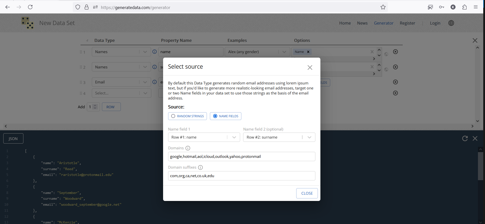

1. prisma(snaplet)
2. neosync
3. typeorm-extension
4. generatedata.com/generator
5. softbuilder
6. knex

key features:

1. can generate field using other fields.
2. generators customization
3. wide choice of data generators
4. using ai to get mostly likely values for your data ?
5. can generate custom values for columns
6. subsetting production database to reduce size of db(pick one desired table and all tables that are related to it will be picked automaticly) while making snapshot of database ?

# [generatedata.com/generator](https://generatedata.com/generator)

website for generating test data

## pros:

 1. can generate field using other fields. 

Example for email generation:
   
   

 2. wide choice of data generators and their customization 

   <a href="https://github.com/benkeen/generatedata/tree/master/client/src/plugins/dataTypes">data generators</a>
   
   generators customization
   

## cons:

1. can generate only one table per one time
2. can't connect to db to seed it

# [prisma/snaplet](https://www.prisma.io)

## pros:

 1. can generate custom values for columns 

    
    

2. using ai to get mostly likely values for your data
3. deterministic data generation due to snaplet/copycat lib.

# snaplet

## pros:

1. subsetting production database to reduce size of db(pick one desired table and all tables that are related to it will be picked automaticly) while making snapshot of database

## cons:

1. can't choose transform function while making snapshot of database

# neosync

## pros

1. generating columns content using chat gpt

## cons

1. should pick each transformer/ generator one by one, there are no preset transformers for columns

2. can't generate more than one table or I didn't find how to achieve this

# softbuilder

## cons

1. narrow choice of generating functions

# knex

seems to not support automatic seeding only manual

# typeorm-extension

## pros

1. wide choice of generating functions due to 'faker-js' lib.
2. can generate field using other fields.

## cons

1. non deterministic data generation
